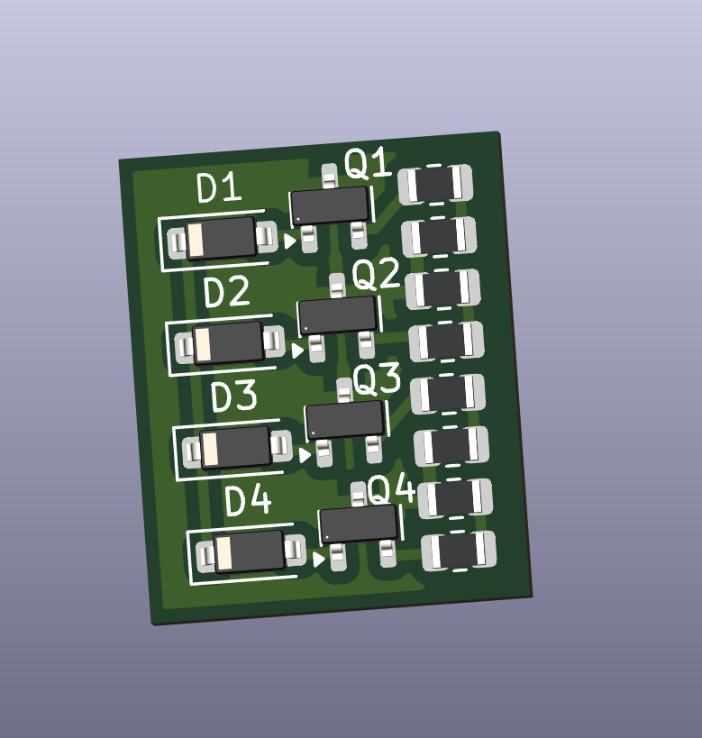
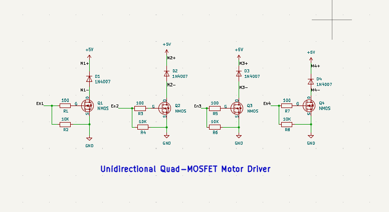

# Unidirectional Quad-MOSFET Motor Driver

This repository contains the KiCad project files for a unidirectional quad-MOSFET motor driver PCB. The design provides four MOSFETs arranged to drive a motor in a single direction (useful for simple brushed DC motor control, high-side or low-side switching depending on the schematic), with supporting passive components and connectors.

## What’s included

- `Unidirectional Quad-MOSFET Motor Driver.kicad_pro` — KiCad project file
- `Unidirectional Quad-MOSFET Motor Driver.kicad_sch` — KiCad schematic sheet
- `Unidirectional Quad-MOSFET Motor Driver.kicad_pcb` — KiCad PCB layout
- `Unidirectional Quad-MOSFET Motor Driver.kicad_prl` — PCB print/plot settings
- `fp-info-cache/` — footprint cache used by KiCad
- `Unidirectional Quad-MOSFET Motor Driver-backups/` — automatic backups exported by KiCad

> Note: Filenames are case-sensitive on some platforms. Keep the project files together in the same folder.

## Project images

Below are a couple of images included in this folder. They are referenced with relative paths so they render on GitHub and locally.

3D view of the PCB:

Main schematic preview:

## Bill of Materials (BOM)

The interactive BOM (ibom) is available in the `bom/` folder. View it locally or on GitHub by clicking link below:

	<a href="bom/ibom.html" style="color: #c0392b; font-weight: 600;">Open interactive BOM (ibom.html)</a>

## Recommended KiCad version

This project was created with KiCad 6.x — KiCad 6 or later is recommended to avoid compatibility issues. If you open the project in an older KiCad version, make a backup first.

## How to open the project

1. Install KiCad (6.x or later): https://kicad.org
2. Open KiCad and select `File > Open Project...` and choose `Unidirectional Quad-MOSFET Motor Driver.kicad_pro` in this folder.
3. Inspect the schematic first (`.kicad_sch`), then open the PCB (`.kicad_pcb`).

## Contributing

If you make improvements (BOM, layout changes, footprint fixes, or add gerbers), please contribute back by creating a PR or adding files to this repo.

## Contact

Add your name and contact details here if you wish to attribute authorship or allow maintainers to contact you regarding the design.

Author: Prashant Bhandari

Email: info@bhandari-prashant.com.np

Phone: +977 9867756915

Location: Pokhara, Nepal

Website: https://bhandari-prashant.com.np/

Social:
- LinkedIn: https://www.linkedin.com/in/prashantbdri
- GitHub: https://github.com/prashantbhandary
- Twitter: https://twitter.com/santhprashant
- Instagram: https://www.instagram.com/_prashant.08/

Short bio: Electronics Engineering student (B.E.) specializing in Robotics, PCB design, and embedded systems. See https://bhandari-prashant.com.np/ for full profile and projects.

---